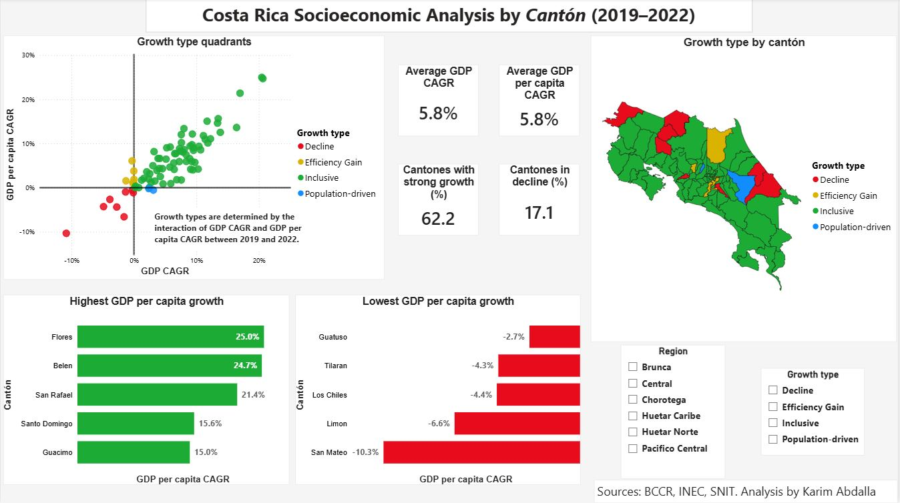

# Costa Rica Socioeconomic Growth Analysis by *Cantón* (2019–2022)

## Project Overview

This project analyzes and compares socioeconomic data for Costa Rican *cantones* between 2019 and 2022. The project showcases the use of Python (Pandas), Excel, QGIS and Power BI within a complete data analysis workflow.

## Project Objective

Compare and contrast the socioeconomic situation of Costa Rican *cantones* in 2019 and 2022, to evaluate the impact of the COVID-19 pandemic on key economic indicators.

## Results Summary

The analysis found that most Costa Rican *cantones* experienced inclusive economic growth between 2019 and 2022 despite the economic disruption caused by COVID-19. However, important regional disparities remained, especially in northern and coastal areas, where several cantones showed declining GDP per capita growth.

Key findings include:
- 80% of cantones showed inclusive growth.
- Only two cantones showed population-driven growth.
- The Huetar Norte region had the weakest overall performance.
- The Brunca region showed the most homogeneous positive growth pattern.

## Data Sources and Overview

- INEC (Instituto Nacional de Estadística y Censos): Population data
- BCCR (Banco Central de Costa Rica): Economic data
- SNIT (Sistema Nacional de Informacion Territorial): *Cantones* geospatial boundaries

### Main datasets
- Population estimates (2019)
- Population census (2022)
- Economic indicators dataset

### Key variables
- GDP
- Population
- GDP per capita
- CAGR metrics
- Growth category and growth type

## Methodology and workflow

1. Raw data ingestion

The files found in `data/raw` were ingested with `clean_data.py`.

2. Initial exploratory data analysis (EDA)

Using `clean_data.py`, the data was extracted and transformed into Pandas dataframes, allowing exploratory analysis to identify required cleaning and transformation steps. 

3. Data cleaning and normalization

The datasets were cleaned, standardized, and transformed into an appropriate input for `merge_data.py`.

4. Dataset merging

Using `merge_data.py`, one dataset including population data and economic indicators for each *cantón* in two specific years (2019 and 2022) was consolidated.

5. Feature engineering

Using `analyze_data.py`, a final dataframe was created, which includes the key economic indicators for both 2019 and 2022. After this, feature engineering was performed to develop some additional metrics for study. A more detailed look of the engineered features can be seen below. This final dataset (`socioeconomic_analysis.csv`) is consolidated and ready to be loaded into an analysis or visualization tool. A sample image of this dataset can be found in `outputs/tables/`.

6. Geospatial standardization

To ensure compatibility between geospatial boundaries and analytical datasets, *cantón* names were normalized in proper case and without accents or special characters. Geospatial boundaries were transformed to account for the changes in *cantones* between 2019 and 2022. The file was converted into TopoJSON format for compatibility with Power BI. A sample image of the attribute table generated can be found in `outputs/tables/`.

7. Dashboard creation

The consolidated dataset (`socioeconomic_analysis.csv`) is loaded into Power BI to create visualizations. Power Query was used to validate data types and confirm that the dataset was ready for visualization.

8. Insight generation

After creating a dashboard in Power BI the data was ready for visualization and generating insights. Filtering the data by region and growth type allowed comparison of development patterns across different socioeconomic regions and growth classifications.

### Engineered Features
| Feature | Comments |
|---|---|
| GDP per capita | GDP was normalized with population to have a more comparable view of the metric in the two specific years. |
| Trade balance | Used to see the dynamics of trade within the *cantón* for 2022. |
| CAGR (various metrics) | CAGR metrics were chosen to further normalize the data and to annualize changes between non-consecutive years (2019–2022), instead of using a standard raw growth metric. CAGR metrics were calculated for GDP, GDP per capita and population. CAGR is defined by `CAGR = (Final Value / Initial Value)^(1 / Years) - 1`|
| Growth classification | Growth categories were defined using conventions commonly found in macroeconomic and financial analysis literature (International Monetary Fund (2024). *World Economic Outlook: Navigating Global Divergences*.). Following this, if the CAGR is over 4%, the growth is defined as 'Strong'. If the value is between 2 and 4%, it is considered 'Moderate'. A growth between 0 and 2% is considered 'Slow'; and one under 0% is considered 'Recession'. |
| Growth type | This nominal metric was also based on the interpretation of conventions found in literature (Barro, R. J., and Sala-i-Martin, X. (2004). *Economic Growth* (2nd ed.)) to make a distinction between scale growth and welfare-adjusted growth. For the purposes of this project, simultaneous growth in both GDP CAGR and GDP per capita CAGR is classified as 'Inclusive'. If GDP CAGR grows but GDP per capita CAGR decreases, the growth is 'Population-driven'. If GDP CAGR decreases but GDP per capita CAGR grows, it is considered 'Efficiency gain'. Lastly, a decrease in both features represents a 'Decline'.|

## Tools Used

- Python (Pandas)
- Power BI
- QGIS
- Excel
- Git/GitHub
- Visual Studio Code

## Setup and Execution

1. Clone the repository

```bash
git clone https://github.com/kab0592/costa-rica-socioeconomic-analysis.git
cd costa-rica-socioeconomic-analysis
```

2. Install dependencies

```bash
pip install -r requirements.txt
```

3. Run the pipeline

```bash
python src/clean_data.py
python src/merge_data.py
python src/analyze_data.py
```

## Folder structure

```text
costa-rica-socioeconomic-analysis/
│
├── dashboards/        # Power BI dashboard and dashboard exports
├── data/
│   ├── raw/           # Original source datasets
│   ├── cleaned/       # Cleaned intermediate datasets
│   ├── processed/     # Final analytical datasets
│   └── geospatial/    # Shapefiles, GeoJSON and TopoJSON
│
├── outputs/
│   ├── figures/       # Exported figures and charts
│   └── tables/        # Exported analytical tables
│
├── src/               # Python scripts for ETL and analysis
│
├── README.md
├── requirements.txt
└── .gitignore
```
The repository follows an ETL-style logic and structure to separate raw, cleaned, processed, geospatial, analytical, and visualization assets to ensure reproducibility and scalability.

## Data Limitations

1. Population records: official records by INEC only included data from the 2022 census and a statistical yearbook from 2017-2019.

2. Economic records: similarly, BCCR only had records from 2019-2022.

3. During the time period studied in this project, specifically between 2021 and 2022, two new *cantones* were created: Monteverde and Puerto Jiménez. For the purpose of this exercise and to allow a 1:1 comparison between 2019 and 2022 data, the information from the two new "cantones" (Monteverde and Puerto Jiménez) was aggregated with the data of the cantones that they used to be part of (Puntarenas and Golfito, respectively). This forced some data transformation and aggregation, as well as some modification to the geospatial boundaries data.

4. Standard growth metrics between two non-consecutive years were considered less interpretable for comparison, so CAGR was used to annualize the changes across the time period. Also, it was decided to use per capita metrics to account for the effect of population increases in GDP.

## Visualizations

### Dashboard
Power BI dashboard includes:
- KPI cards for key metrics
- GDP CAGR vs GDP per capita CAGR scatter plot by growth type
- Choropleth map of *cantones* by growth type
- Ranked bar graph for *cantones* with higher GDP per capita CAGR
- Ranked bar graph for *cantones* with lower GDP per capita CAGR
- Slicers to filter by region and/or growth type

The filtering by regions was added because they group *cantones* by shared economic, climatic, and development characteristics, allowing more specific regional comparisons.



## Key Insights

1. The Brunca region was the only one with exclusively an inclusive economic growth, and thus the most homogeneous in growth type. The Central region was the most heterogeneous one, having at least one *cantón* from each growth type.

2. Only the Brunca and Central regions had above-average GDP and GDP per capita growth, measured by CAGR.

3. The Huetar Norte region has the lowest GDP and GDP per capita growth in the period, with 50% of its *cantones* showing economic decline.

4. Only two *cantones*, Poás and Turrialba, showed a population-driven growth, indicating that population increases were faster than gains in economic productivity.

5. Most *cantones* (80%) had an inclusive growth during the period. The ones that showed economic decline are mostly in rural areas along the east coast and the northern border.

## Future Improvements

- Add time-series analysis using additional years of data.
- Incorporate other metrics such as poverty indexes, COVID-19 affectation, inequality indexes and human development index.
- Automate geospatial processing with GeoPandas
- Develop statistical models for prediction and analysis of economic patterns.

## Skills Demonstrated

- Data cleaning and transformation with Python and Pandas
- ETL pipeline development
- Feature engineering and economic metric calculation
- Geospatial data processing with QGIS
- TopoJSON preparation for Power BI Shape Maps
- Data visualization and dashboard design in Power BI
- Analytical storytelling and insight generation
- Git/GitHub repository organization